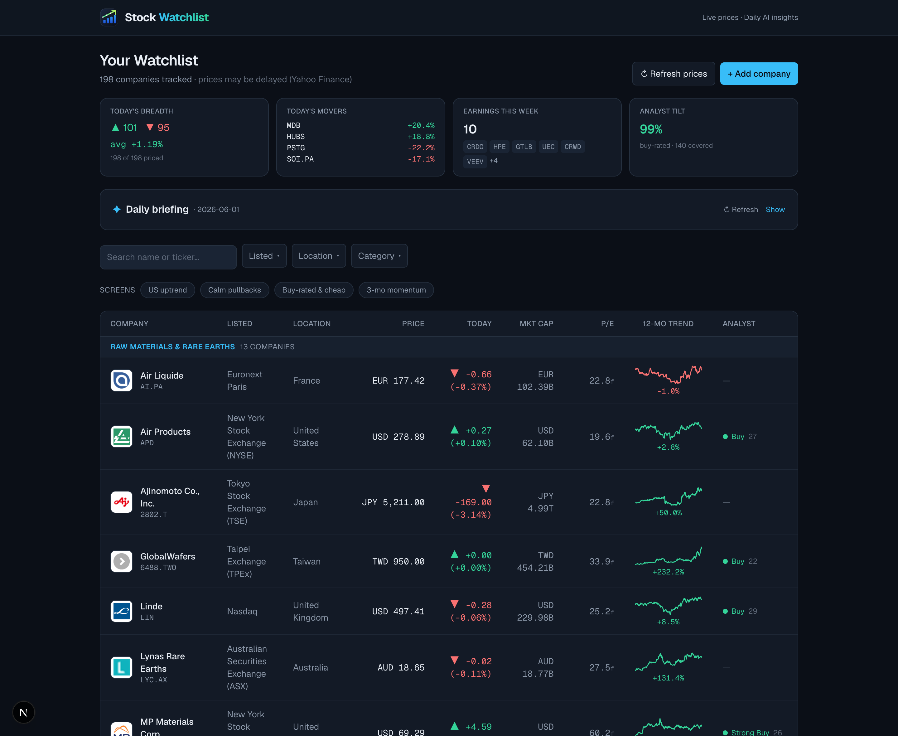

# Stock Watchlist

A local-first web app for tracking a stock watchlist — built around the **AI / semiconductor
value chain**, but it works for any tickers you add. Live prices, 12-month trends, fundamentals,
analyst consensus, next-earnings dates, one-click smart screens, and AI-written briefings —
all in a dark trading-dashboard UI.

> **Educational information, not financial advice.** Market data is delayed and not guaranteed
> accurate. Verify against your broker before trading. AI output can be wrong.



## Features

- **Watchlist** grouped by value-chain layer — price, today's move, market cap, 12-mo sparkline,
  P/E, analyst rating, and next earnings per company.
- **Watchlist Pulse** — at-a-glance breadth, top movers, earnings this week, and analyst tilt.
- **Smart screens** — one-click presets (US uptrend, calm pullbacks, buy-rated & cheap, 3-mo momentum).
- **Company detail** — price-history chart, fundamentals, analyst consensus, a "where to buy"
  broker guide, editable notes, and a per-company AI insight.
- **Daily AI briefing** — Claude synthesizes the whole watchlist into a short market-tone summary.
- **Company logos** with a graceful colored-monogram fallback.

## The thesis — tracking the whole AI infrastructure supply chain

This watchlist exists because of a simple idea: **the biggest opportunity in AI isn't picking
the one winning model or chatbot — it's the entire supply chain being built to power it.**
Every AI breakthrough rests on a deep stack of physical and digital infrastructure: the sand and
rare earths refined into wafers, the lithography machines that pattern them, the chips, the
foundries, the servers and networking that lash them together, the data centers that house them,
the cooling and the power grid that keep them running, and finally the cloud, software, models,
and apps on top.

So instead of betting on a single name, the watchlist maps **15 layers of that value chain**,
top (raw inputs) to bottom (end demand) — and tracks the notable companies in each. Seeing them
grouped this way makes the dependencies obvious: a wafer shortage upstream, or a power/cooling
bottleneck at the data-center layer, ripples through everything below it.

| # | Layer | What it covers |
|---|-------|----------------|
| 1 | Raw materials & rare earths | Wafers, silicon, photoresists, specialty gases, rare-earth magnets |
| 2 | Semiconductor equipment | Litho, deposition, etch, metrology, test & advanced packaging tools |
| 3 | Chip designers | GPUs, CPUs, custom ASICs, networking silicon |
| 4 | Foundries & memory | Leading-edge fabs and DRAM/HBM/NAND makers |
| 5 | AI servers & hardware OEMs | Server/system builders and contract manufacturers |
| 6 | Networking | Switches, optical transceivers, interconnect, connectors |
| 7 | Storage | Enterprise HDD/SSD and storage systems |
| 8 | Data centers & REITs | Colocation, hyperscale REITs, neoclouds |
| 9 | Cooling & DC power | Liquid cooling, power distribution, thermal management |
| 10 | Hyperscaler cloud (Western) | The big US cloud platforms |
| 11 | Hyperscaler cloud & AI (Asia) | China/Asia cloud and AI platforms |
| 12 | AI software & data | Data platforms, MLOps, vector DBs, security |
| 13 | Foundation models | Model-builder companies |
| 14 | End applications | Consumer, enterprise, and vertical AI products |
| 15 | Energy, utilities & grid | Power generation (incl. nuclear), utilities, grid & transmission |

> These are the companies *I* find notable in each layer — it's a starting map, not gospel.
> Fork it, add your own names, re-classify, and make it yours. PRs that improve the map are welcome.

### The starter watchlist (≈198 companies)

Loaded by `node scripts/seed-watchlist.mjs`. Symbols are Yahoo Finance tickers (suffixes denote
the listing exchange, e.g. `.T` Tokyo, `.HK` Hong Kong, `.TW`/`.TWO` Taiwan, `.KS` Korea, `.L`
London, `.PA` Paris, `.DE`/`.SS`/`.SZ` etc.).

<details>
<summary><strong>Show all companies by layer</strong></summary>

**Raw materials & rare earths** (13) — Shin-Etsu Chemical (`4063.T`) · SUMCO (`3436.T`) · Siltronic (`WAF.DE`) · GlobalWafers (`6488.TWO`) · Tokyo Ohka Kogyo (`4186.T`) · Ajinomoto (`2802.T`) · Soitec (`SOI.PA`) · MP Materials (`MP`) · Lynas Rare Earths (`LYC.AX`) · USA Rare Earth (`USAR`) · Linde (`LIN`) · Air Liquide (`AI.PA`) · Air Products (`APD`)

**Semiconductor equipment** (18) — ASML (`ASML`) · Applied Materials (`AMAT`) · Lam Research (`LRCX`) · KLA (`KLAC`) · Tokyo Electron (`8035.T`) · ASM International (`ASM.AS`) · Advantest (`6857.T`) · Teradyne (`TER`) · BESI (`BESI.AS`) · Disco Corp (`6146.T`) · Screen Holdings (`7735.T`) · Onto Innovation (`ONTO`) · Camtek (`CAMT`) · Nova (`NVMI`) · Entegris (`ENTG`) · Kokusai Electric (`6525.T`) · MKS Instruments (`MKSI`) · Axcelis (`ACLS`)

**Chip designers** (11) — NVIDIA (`NVDA`) · AMD (`AMD`) · Intel (`INTC`) · Broadcom (`AVGO`) · Marvell (`MRVL`) · Qualcomm (`QCOM`) · Arm Holdings (`ARM`) · MediaTek (`2454.TW`) · Alchip Technologies (`3661.TW`) · Socionext (`6526.T`) · Cerebras Systems (`CBRS`)

**Foundries & memory** (10) — TSMC (`TSM`) · Samsung Electronics (`005930.KS`) · SK Hynix (`000660.KS`) · Micron (`MU`) · GlobalFoundries (`GFS`) · UMC (`UMC`) · SMIC (`0981.HK`) · Hua Hong (`1347.HK`) · Tower Semiconductor (`TSEM`) · Kioxia (`285A.T`)

**AI servers & hardware OEMs** (11) — Super Micro (`SMCI`) · Dell Technologies (`DELL`) · HPE (`HPE`) · Lenovo (`0992.HK`) · Foxconn / Hon Hai (`2317.TW`) · Wiwynn (`6669.TW`) · Quanta Computer (`2382.TW`) · Wistron (`3231.TW`) · Inventec (`2356.TW`) · Giga-Byte (`2376.TW`) · IBM (`IBM`)

**Networking** (13) — Arista Networks (`ANET`) · Cisco Systems (`CSCO`) · Ciena (`CIEN`) · Coherent (`COHR`) · Lumentum (`LITE`) · Fabrinet (`FN`) · Celestica (`CLS`) · Amphenol (`APH`) · TE Connectivity (`TEL`) · Innolight (`300308.SZ`) · Accton (`2345.TW`) · Credo Technology (`CRDO`) · Astera Labs (`ALAB`)

**Storage** (4) — Western Digital (`WDC`) · Seagate (`STX`) · Pure Storage (`PSTG`) · NetApp (`NTAP`)

**Data centers & REITs** (17) — Equinix (`EQIX`) · Digital Realty (`DLR`) · Iron Mountain (`IRM`) · Keppel DC REIT (`AJBU.SI`) · GDS Holdings (`GDS`) · VNET Group (`VNET`) · NEXTDC (`NXT.AX`) · Goodman Group (`GMG.AX`) · Segro (`SGRO.L`) · Applied Digital (`APLD`) · CoreWeave (`CRWV`) · Nebius Group (`NBIS`) · IREN (`IREN`) · TeraWulf (`WULF`) · Hut 8 (`HUT`) · Core Scientific (`CORZ`) · Cipher Mining (`CIFR`)

**Cooling & DC power** (10) — Vertiv Holdings (`VRT`) · nVent Electric (`NVT`) · Johnson Controls (`JCI`) · Trane Technologies (`TT`) · Munters (`MTRS.ST`) · Legrand (`LR.PA`) · Modine Manufacturing (`MOD`) · Asetek (`ASTK.OL`) · Delta Electronics (`2308.TW`) · LiteOn (`2301.TW`)

**Hyperscaler cloud (Western)** (5) — Microsoft (`MSFT`) · Amazon (`AMZN`) · Alphabet / Google (`GOOGL`) · Meta Platforms (`META`) · Oracle (`ORCL`)

**Hyperscaler cloud & AI (Asia)** (10) — Alibaba (`BABA`) · Tencent (`0700.HK`) · Baidu (`BIDU`) · Kuaishou (`1024.HK`) · JD.com (`JD`) · Cambricon (`688256.SS`) · SenseTime (`0020.HK`) · iFlytek (`002230.SZ`) · NAVER (`035420.KS`) · Rakuten (`4755.T`)

**AI software & data** (17) — Palantir (`PLTR`) · Snowflake (`SNOW`) · MongoDB (`MDB`) · Datadog (`DDOG`) · ServiceNow (`NOW`) · Salesforce (`CRM`) · Elastic (`ESTC`) · Confluent (`CFLT`) · GitLab (`GTLB`) · Cloudflare (`NET`) · UiPath (`PATH`) · C3.ai (`AI`) · Workday (`WDAY`) · Veeva (`VEEV`) · SAP (`SAP`) · Zscaler (`ZS`) · CrowdStrike (`CRWD`)

**End applications** (17) — Adobe (`ADBE`) · Apple (`AAPL`) · Tesla (`TSLA`) · Duolingo (`DUOL`) · Shopify (`SHOP`) · Intuit (`INTU`) · HubSpot (`HUBS`) · AppLovin (`APP`) · Trade Desk (`TTD`) · Recursion Pharma (`RXRX`) · Schrödinger (`SDGR`) · Tempus AI (`TEM`) · Klaviyo (`KVYO`) · Freshworks (`FRSH`) · SoundHound AI (`SOUN`) · Samsara (`IOT`) · Procore (`PCOR`)

**Energy, utilities & grid** (43) — Constellation Energy (`CEG`) · Vistra (`VST`) · Talen Energy (`TLN`) · NextEra (`NEE`) · Dominion Energy (`D`) · Duke Energy (`DUK`) · Southern Company (`SO`) · AEP (`AEP`) · Exelon (`EXC`) · PSEG (`PEG`) · Entergy (`ETR`) · Cameco (`CCJ`) · BWX Technologies (`BWXT`) · NuScale Power (`SMR`) · Oklo (`OKLO`) · Nano Nuclear Energy (`NNE`) · Centrus Energy (`LEU`) · Uranium Energy Corp (`UEC`) · Denison Mines (`DNN`) · NexGen Energy (`NXE`) · Kazatomprom (`KAP.L`) · GE Vernova (`GEV`) · Siemens Energy (`ENR.DE`) · Mitsubishi Heavy (`7011.T`) · Caterpillar (`CAT`) · Cummins (`CMI`) · Generac (`GNRC`) · Kinder Morgan (`KMI`) · Williams Companies (`WMB`) · Energy Transfer (`ET`) · EQT Corp (`EQT`) · Eaton (`ETN`) · Schneider Electric (`SU.PA`) · ABB (`ABBN.SW`) · Hitachi (`6501.T`) · Hubbell (`HUBB`) · Quanta Services (`PWR`) · MYR Group (`MYRG`) · Prysmian (`PRY.MI`) · Nexans (`NEX.PA`) · Brookfield Renewable (`BEPC`) · First Solar (`FSLR`) · Nextracker (`NXT`)

</details>

## Stack

- **Next.js 16** (App Router, TypeScript) — UI + server API routes
- **Tailwind CSS 4** — dark trading-dashboard theme
- **Prisma 7 + SQLite** (`dev.db`) — local storage via the better-sqlite3 driver adapter
- **yahoo-finance2** — free live quotes, history, profile & fundamentals (no API key)
- **Finnhub** — analyst recommendation trends (optional API key)
- **FRED** — macro context: rates, yield curve, CPI (optional API key)
- **@anthropic-ai/sdk** — Claude writes the daily briefing + per-company insights (optional API key)

## Run it yourself

```bash
git clone https://github.com/gilliancai/stock-watchlist-app.git
cd stock-watchlist-app
npm install
cp .env.example .env          # then add any optional keys you have (see below)
npx prisma migrate dev        # creates dev.db from the migrations
npm run dev                   # http://localhost:3000
```

Add a starter watchlist (a curated AI/semiconductor list) once the dev server is running:

```bash
node scripts/seed-watchlist.mjs
```

…or just click **+ Add company** and enter any ticker (e.g. `NVDA`, `ASML`, `0700.HK`).

## Optional API keys

Everything core (prices, history, fundamentals, charts) works with **no keys at all** —
Yahoo Finance needs none. The keys below light up extra features and degrade gracefully when absent:

| Key | Enables | Get one |
|-----|---------|---------|
| `ANTHROPIC_API_KEY` | Daily AI briefing + per-company insights | https://console.anthropic.com/ |
| `FINNHUB_API_KEY` | Analyst consensus (recommendation trend) | https://finnhub.io/register |
| `FRED_API_KEY` | Macro strip (rates, yield curve, CPI) | https://fredaccount.stlouisfed.org/apikeys |

Add them to `.env` and restart the dev server. Without a given key, that feature simply stays hidden.

## How it works

- **Caching** — quotes (2 min), history/earnings/fundamentals (12–24 h), analyst (12 h) and the
  daily briefing (1/day) are cached in SQLite, so reopening pages is instant and you aren't billed
  twice for AI calls. Pass `?force=1` on `/api/quote/<symbol>` to bypass.
- **Swap the data provider** — `yahoo-finance2` is an unofficial free library, great for personal
  use. To move to a paid/official provider, reimplement `src/lib/yahoo.ts`; nothing else changes.
- **Backfill scripts** (`scripts/`) pre-warm caches (domains/logos, fundamentals, analyst) across
  the whole watchlist; run them with the dev server up.

## Project layout

```
src/
  app/
    page.tsx                          # dashboard (server component)
    companies/[id]/page.tsx           # company detail
    api/companies/…                   # list / add / update / delete
    api/quote/[symbol]/route.ts       # quote (+ history, profile, fundamentals, analyst)
    api/macro/route.ts                # FRED macro snapshot
    api/digest/route.ts               # daily AI briefing
    api/insights/[id]/route.ts        # per-company AI insight
  components/                         # Dashboard, CompanyDetail, WatchlistPulse, DigestPanel,
                                      #   MacroStrip, CompanyLogo, Logo, PriceChart, …
  lib/                                # prisma, yahoo, finnhub, fred, anthropic, *Cache, analyst, …
prisma/schema.prisma                  # Company, Quote, Fundamentals/Analyst/Macro caches, Digest, …
```

## License

[MIT](LICENSE) — free to use, modify, and distribute. Contributions welcome.
